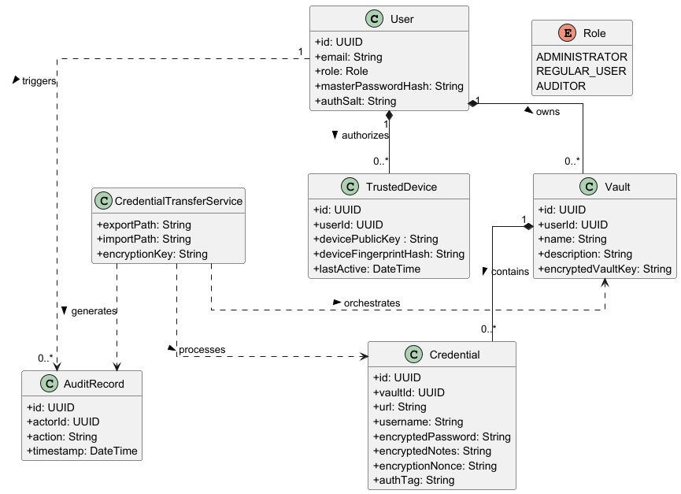
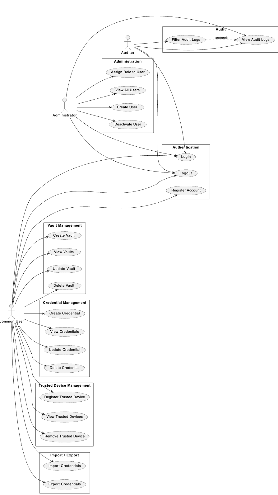

# System Overview

## Domain Model

## Use Case Diagram

## Functional Requirements

The following functional requirements define the main services and behaviours that the Kryptos system must provide to its users and administrators.

**FR1 – User Registration**
The system shall allow a new user to create an account by providing the required registration data.

**FR2 – User Authentication**
The system shall allow registered users to authenticate using their credentials in order to access the platform.

**FR3 – Role-Based Access Control**
The system shall assign a role to each user and enforce access permissions according to that role. At a minimum, the system shall support the roles Administrator, Common User, and Auditor.

**FR4 – User Data Isolation**
The system shall ensure that each common user can only access and manage their own vaults, credentials, and trusted devices.

**FR5 – Vault Creation**
The system shall allow authenticated users to create logical vaults to organize their credentials.

**FR6 – Vault Management**
The system shall allow authenticated users to view, update, and delete their own vaults.

**FR7 – Credential Creation**
The system shall allow authenticated users to create credentials associated with one of their vaults.

**FR8 – Credential Management**
The system shall allow authenticated users to view, update, and delete their own credentials.

**FR9 – Credential Association to Services**
The system shall allow each credential to store authentication-related information associated with a specific service, platform, or website.

**FR10 – Trusted Device Registration**
The system shall allow authenticated users to register trusted devices associated with their account.

**FR11 – Trusted Device Management**
The system shall allow authenticated users to view and manage their trusted devices.

**FR12 – Trusted Device Monitoring**
The system shall record the origin device of relevant accesses or credential-related actions whenever applicable.

**FR13 – Credential Export**
The system shall allow authorized users to export credentials into a temporary file in a defined format.

**FR14 – Credential Import**
The system shall allow authorized users to import credentials from a file in a defined format.

**FR15 – Temporary Directory Creation**
The system shall create directories on the server when required to support import and export operations.

**FR16 – Temporary File Handling**
The system shall write, read, and process temporary files required for import and export operations.

**FR17 – Secure File Deletion**
The system shall securely delete temporary files from disk after the import or export process is completed.

**FR18 – Audit Logging**
The system shall generate audit logs for sensitive actions, including authentication events, credential management actions, import/export operations, and secure wipe actions.

**FR19 – Administrative User Management**
The system shall allow administrators to manage user accounts and their assigned roles.

**FR20 – Audit Access**
The system shall allow auditors to consult audit-relevant information according to their permissions, without granting them full operational control over user data.

**FR21 – Relational Data Persistence**
The system shall persist application data using a relational database.

**FR22 – REST API Access**
The system shall expose its functionalities through a RESTful API that can be consumed by external clients.

## Non-Functional Requirements

The following non-functional requirements define the quality attributes and constraints that the Kryptos system must satisfy.

### Security

**NFR1 – Encryption at Rest**
All credentials and sensitive data stored in the database must be encrypted using a strong symmetric encryption algorithm (e.g., AES-256).

**NFR2 – Password Hashing**
User passwords must be stored using a strong adaptive hashing algorithm (e.g., bcrypt or Argon2) and must never be stored in plaintext.

**NFR3 – Secure Communication**
All communication between clients and the server must be performed over HTTPS/TLS. Unencrypted HTTP connections must not be accepted.

**NFR4 – JWT Authentication**
All authenticated API requests must use JWT (JSON Web Tokens) with appropriate expiration times. Tokens must be validated on every request.

**NFR5 – Rate Limiting**
Sensitive endpoints, including authentication, credential import/export, and account management, must implement rate limiting to mitigate brute-force and abuse attacks.

**NFR6 – Input Validation**
All endpoints must validate and sanitize input data to prevent injection attacks, malformed requests, and unexpected system behaviour.

**NFR7 – Immutable Audit Logs**
Audit log entries must be immutable after creation. No user or administrator shall be able to modify or delete existing audit records.

### Performance

**NFR8 – API Response Time**
The system must respond to standard API requests (read and write operations) within an acceptable time frame under normal load conditions.

**NFR9 – Pagination**
All endpoints that return lists of resources (credentials, vaults, devices, audit logs) must support pagination to ensure performance under large data volumes.

### Reliability

**NFR10 – Availability**
The system must maintain a minimum availability of 99.5% during normal operating conditions.

**NFR11 – Import Rollback**
In the event of a failure during a credential import operation, the system must roll back any partial changes and clean up all temporary files created during the process.

### Maintainability & Interoperability

**NFR12 – Relational Data Persistence**
The system must persist all application data using a relational database, ensuring data integrity through constraints and transactional operations.

**NFR13s – REST API**
The system must expose its functionalities exclusively through a RESTful API, following standard HTTP conventions, to allow integration with external clients or frontend interfaces.

## Security Requirements

### General Requirements

1. All endpoints must enforce authentication and validate roles via RBAC.
2. All endpoints must validate and sanitize input data.
3. All endpoints must use HTTPS/TLS — unencrypted connections must be rejected.
4. All failed authentication attempts must be logged.
5. Rate limiting must be applied to sensitive endpoints (login, import/export, account management).
6. Passwords must be stored using a strong hashing algorithm (bcrypt or Argon2).
7. JWT tokens must have defined expiration times and be validated on every request.
8. Credentials must be encrypted at rest before being stored in the database.
9. Temporary files created during import/export must be securely wiped after use.
10. Access to audit logs must be restricted to users with the Auditor or Administrator role.

### User Requirements

1. As a Common User, I can only access and manage my own vaults, credentials, and trusted devices.
2. As a Common User, I want my stored credentials to be encrypted so they remain protected even in the event of a database breach.
3. As a Common User, I want to register trusted devices to control which devices have access to my data.
4. As a Common User, I want to export and import my credentials securely, without sensitive data being exposed during the process.
5. As a Common User, I want a log of important actions performed on my account (login, credential changes, exports).
6. As a Common User, I want my session to expire after a defined period of inactivity to prevent unauthorized access.
7. As an Administrator, I want to manage user accounts and roles without being able to access individual users’ stored credentials.
8. As an Administrator, I want all administrative actions (role changes, account management) to be logged.
9. As an Auditor, I want to consult audit logs without being able to modify them or access sensitive credential data.
10. As an Auditor, I want audit records to be immutable so they can be trusted as evidence.

## Architectural Design

### Logic view

#### Level 1:

#### Level 2:

#### Level 3:

### Implementation View

#### Level 1:

#### Level 2:

#### Level 3:

### Deployment View

#### Future Deployment View
