# STRIDE

## Threat List

### User Authentication

| DFD Element | STRIDE | Threats Across Data Flow | Abuse Case |
| --- | --- | --- | --- |
| **External Entity:** Anonymous User | **Spoofing** | Attacker uses automated scripts with leaked password lists to log into victim accounts via the API. | **Brute Force / Credential Stuffing (R01)** |
| **Data Flow:** JWT Token | **Spoofing** | Attacker steals an active JWT token and replays it to impersonate the user without needing their password. | **Session Hijacking (R19)** |
| **Data Flow:** Submit Login Credentials | **Tampering** | Attacker intercepts the JSON payload during login and manipulates the requested token scopes or MFA flags. | **Session Fixation** |
| **Data Store:** User DB | **Tampering** | An attacker who gains internal DB access alters the password hash to a known value to establish a backdoor. | `---` *(Systemic DB Tampering)* |
| **Process:** Authentication Process | **Repudiation** | Failed login attempts and account lockouts are not logged, preventing admins from detecting brute-force attacks. | `---` |
| **Data Store:** User DB | **Information Disclosure** | The database is compromised, and because passwords were hashed with MD5 instead of Argon2, they are easily cracked. | **Brute Force / Credential Stuffing (R01)** |
| **Process:** Authentication Process | **Information Disclosure** | The login API returns different HTTP status codes or messages depending on whether the username exists, allowing account enumeration. | **Account Enumeration** |
| **Process:** Authentication Process | **Denial of Service** | Attacker floods the `/api/auth/login` endpoint with computationally expensive 50,000-character passwords to exhaust server CPU. | **Log Flooding (DoS) (R16)** |
| **Data Flow:** JWT Token | **Elevation of Privilege** | Attacker manipulates the `role` claim in the JWT payload from `user` to `admin` and signs it using a weak algorithm. | **JWT Manipulation (R02)** |

### User Management

| DFD Element | STRIDE | Threats Across Data Flow | Abuse Case |
| --- | --- | --- | --- |
| **External Entity:** User | **Spoofing** | Attacker exploits a session fixation flaw to send forged administrative requests to the `/api/users` endpoints. | **Admin Account Takeover** |
| **Data Flow:** User Management Request | **Tampering** | Attacker modifies the JSON body of a PUT request to update their own profile, modifying the `role` field (Mass Assignment). | **Privilege Escalation (R04)** |
| **Data Store:** User DB | **Tampering** | A malicious insider with DB access alters user roles directly in the database, bypassing the application's RBAC checks. | `---` |
| **Process:** Backend API | **Repudiation** | Admin actions, such as manually changing user roles or deleting accounts, are not recorded in an immutable audit log. | `---` |
| **Data Store:** User DB | **Information Disclosure** | A GET request to `/api/users` returns excessive data in the JSON response (e.g., password hashes, MFA codes) instead of just public metadata. | **Profile Data Scraping** |
| **Process:** Backend API | **Information Disclosure** | An attacker uses IDOR on the `/api/users/{id}` endpoint to systematically download the personal details of all registered users. | **Profile Data Scraping** |
| **Process:** Backend API | **Denial of Service** | Attacker abuses the user creation endpoint by scripting thousands of bogus registrations per minute, exhausting DB connections. | **Mass Account Lockout** |
| **Process:** Backend API | **Elevation of Privilege** | A regular user sends a POST request to the admin-only `/api/users/{id}/role` endpoint, bypassing broken access controls. | **Privilege Escalation (R04)** |

### Vault Management

| DFD Element | STRIDE | Threats Across Data Flow | Abuse Case |
| --- | --- | --- | --- |
| **External Entity:** User | **Spoofing** | Attacker accesses vaults they do not own by guessing or enumerating Vault IDs in the URL (IDOR) using their own valid user token. | **IDOR on Vault Endpoints (R07)** |
| **Data Flow:** Vault Management Request | **Tampering** | Attacker injects malicious JSON payloads (e.g., NoSQL injection or XSS payloads) into the `vault_name` field. | **Vault Metadata Injection** |
| **Process:** Vault Management Process | **Tampering** | Attacker sends a vault name exceeding the DB column limit, causing a truncation error that might overwrite another vault's record. | **Vault Metadata Injection** |
| **Process:** Vault Management Process | **Repudiation** | Vault deletion is not logged with the user's ID and timestamp, allowing a user to destroy a shared vault and deny having done so. | `---` |
| **Data Flow:** Query / Store Vault | **Information Disclosure** | The API returns all vaults in the system if the `owner_id` filter is manipulated or omitted in the GET request, leaking metadata. | **Unauthorized Vault Deletion** |
| **Process:** Vault Management Process | **Denial of Service** | Attacker scripts the creation of tens of thousands of empty vaults, exhausting the DB quota and degrading query performance. | **Resource Exhaustion** |
| **Process:** Vault Management Process | **Elevation of Privilege** | Attacker manipulates the `owner_id` parameter during vault creation to assign the vault to an admin user, bypassing storage quotas. | **Unauthorized Vault Deletion** |

### Credential Management

| DFD Element | STRIDE | Threats Across Data Flow | Abuse Case |
| --- | --- | --- | --- |
| **External Entity:** User | **Spoofing** | Attacker exploits a weakness in the vault sharing mechanism to submit credential read/write requests masquerading as the owner. | **Malicious Deletion** |
| **Process:** Credential Management Process | **Tampering** | Attacker intercepts encrypted ciphertext and flips bits. Without Authenticated Encryption (e.g., AES-GCM), the API stores corrupted data. | **Credential Tampering** |
| **Process:** Credential Management Process | **Repudiation** | The system fails to log the exact ID of the credential being revealed, making it impossible to audit exfiltrated passwords. | `---` |
| **Data Store:** Credential DB | **Information Disclosure** | Plaintext credentials leak via verbose API error messages when decryption fails. | **Mass Data Exfiltration / IDOR (R05)** |
| **Process:** Credential Management Process | **Information Disclosure** | The API response for a "List Credentials" endpoint includes the decrypted passwords in the JSON, instead of returning them masked. | **Mass Data Exfiltration / IDOR (R05)** |
| **Process:** Credential Management Process | **Denial of Service** | Attacker sends thousands of GET requests for encrypted credentials, exhausting CPU by forcing continuous cryptographic decryption. | `---` |
| **Data Flow:** Verify Vault Ownership | **Elevation of Privilege** | Attacker modifies the `vault_id` in a POST request to inject a credential into a vault they only have 'Read' access to. | **Unauthorized Credential Access** |

### Trusted Devices Management

| DFD Element | STRIDE | Threats Across Data Flow | Abuse Case |
| --- | --- | --- | --- |
| **External Entity:** User | **Spoofing** | Attacker steals a session token and registers a rogue device fingerprint, allowing persistent access even after password changes. | **Rogue Device Registration (R17)** |
| **Data Flow:** Device Management Request | **Tampering** | Attacker modifies the public key or device identifier in the registration payload, causing a mismatch that locks the user out of MFA. | `---` |
| **Process:** Trusted Device Management Process | **Repudiation** | Registration of a new trusted device occurs without sending an out-of-band notification (email alert) to the legitimate user. | `---` |
| **Data Store:** Trusted Device (DB) | **Information Disclosure** | The API endpoint returns sensitive exact device fingerprints, OS versions, or IPs that can be used to target the user with exploits. | `---`  |
| **Process:** Trusted Device Management Process | **Denial of Service** | Attacker registers the maximum allowed number of dummy devices for a target user, preventing them from registering a real device. | **Unauthorized Device Removal** |
| **Process:** Trusted Device Management Process | **Elevation of Privilege** | Attacker exploits an IDOR on the device deletion endpoint to unregister an Administrator's trusted devices, forcing MFA fallback. | **Rogue Device Registration (R17)** |

### Import Vault

| DFD Element | STRIDE | Threats Across Data Flow | Abuse Case |
| --- | --- | --- | --- |
| **External Entity:** User | **Spoofing** | Attacker uses a hijacked JWT to access the import endpoint and injects a malicious credential file directly into the victim's vault. | **Malicious File Upload (R08)** |
| **Process:** Validate Imported Data | **Tampering** | Attacker uploads a CSV containing Path Traversal characters (`../../../`) in the filename to overwrite system files. | **Malicious File Upload (R08)** |
| **Process:** Validate Imported Data | **Tampering** | Attacker injects malicious SQL or script payloads within the CSV credential fields to exploit the backend parser. | **Malicious File Upload (R08)** |
| **Process:** Log Import Operation | **Repudiation** | The system imports 500 credentials but only logs "Import Successful", masking which specific malicious entries were created. | `---` |
| **Data Store:** Temporary file (OS / File System) | **Information Disclosure** | The uploaded file is stored temporarily in `/tmp` with default `0644` permissions, allowing other OS processes to read the plaintext. | `---` |
| **Process:** Receive Import File | **Denial of Service** | Attacker uploads a massive 5GB CSV file or Zip Bomb, exhausting server RAM during the parsing process. | **Malicious File Upload (R08)** |
| **Data Store:** Temporary file (OS / File System) | **Denial of Service** | Attacker uploads thousands of small files concurrently, exhausting the inodes or disk space on the ephemeral storage volume. | `---` |
| **Process:** Persist credentials | **Elevation of Privilege** | Attacker manipulates the form data to specify a `target_vault_id` they do not own, injecting their credentials into an admin's vault. | **Malicious File Upload (R08)** |

### Export Vault

| DFD Element | STRIDE | Threats Across Data Flow | Abuse Case |
| --- | --- | --- | --- |
| **External Entity:** User | **Spoofing** | Attacker leverages a hijacked JWT to silently trigger a full background export of the victim's vault to a temporary file. | **Session Hijacking for Vault Export (R19)** |
| **Data Flow:** Vault Exported | **Tampering** | Attacker intercepts the stream of the exported file over a misconfigured HTTP connection to inject malicious URLs into the entries. | `---` |
| **Process:** Log Export Operation | **Repudiation** | A mass export of a user's entire vault is not flagged or alerted in the audit logs, leaving no forensic trail of the data exfiltration. | `---` |
| **Data Store:** Temporary file (OS / File System) | **Information Disclosure** | The exported temporary file is generated with predictable filenames in a publicly accessible web directory, allowing arbitrary downloads. | **Export Data Leakage** |
| **Process:** Generate Export File | **Information Disclosure** | The exported file is generated as a plaintext CSV instead of an encrypted archive, exposing passwords in transit and at rest on the client. | **Export Data Leakage** |
| **Process:** Generate Export File | **Denial of Service** | Attacker repeatedly calls the `/api/vaults/export` endpoint, forcing the DB to perform heavy reads and exhausting memory formatting files. | **Export Endpoint Abuse (DoS) (R11)** |
| **Process:** Retrieve Credentials | **Elevation of Privilege** | Attacker changes the `vault_id` in the export GET request. The API fails to verify ownership (IDOR), exporting another user's vault. | **IDOR on Export Endpoint (R10)** |

### System Audit Log

| DFD Element | STRIDE | Threats Across Data Flow | Abuse Case |
| --- | --- | --- | --- |
| **Process:** Write Audit Logs | **Spoofing** | Attacker spoofs the internal IP of the API gateway to send forged log events directly to the internal logging service. | **Log Injection / False Trails (R15)** |
| **Data Store:** Audit Logs (DB) | **Tampering** | An attacker with DB access modifies timestamps or drops rows in the `audit_logs` table to erase evidence of a breach. | **Audit Log Tampering / Deletion (R14)** |
| **Process:** Write Audit Logs | **Repudiation** | The logging service drops events under heavy API load (fire-and-forget), resulting in critical security actions being permanently lost. | `---` |
| **Data Store:** Audit Logs (DB) | **Information Disclosure** | The API logs raw HTTP request payloads, inadvertently storing plaintext passwords or valid JWT tokens in the database. | `---` |
| **Process:** Write Audit Logs | **Denial of Service** | Attacker intentionally triggers thousands of auth failures per second to fill the database disk space and crash the logging system. | **Log Flooding (DoS) (R16)** |
| **Process:** Write Audit Logs | **Elevation of Privilege** | Attacker injects a payload (like Log4Shell) into the `User-Agent` header, which executes when an admin views the logs. | **Log Injection (Log4Shell-like) (R15)** |

### Secure Wipe Temporary Files

| DFD Element | STRIDE | Threats Across Data Flow | Abuse Case |
| --- | --- | --- | --- |
| **Data Flow:** Wipe request | **Spoofing** | Attacker intercepts the internal command to trigger the wipe process and substitutes a different file path, preventing the wipe. | `---` |
| **Data Flow:** Secure delete request | **Tampering** | Attacker removes execution permissions on the secure wipe utility at the OS level, causing the application to fall back to insecure `rm`. | `---` |
| **Data Flow:** Secure wipe event | **Repudiation** | The secure wipe function catches an `IOException` but fails to alert the monitoring system, leaving the admin unaware of the orphaned file. | `---` |
| **Data Store:** Temporary Files | **Information Disclosure** | The system uses standard OS deletion. The data remains intact on physical disk blocks, allowing data recovery with forensic tools. | `---` |
| **Data Store:** Temporary Files | **Denial of Service** | Attacker holds a mandatory OS-level file lock on the temporary file. The API's background wipe thread blocks indefinitely. | `---` |
| **Process:** Secure Wipe Temp Files | **Elevation of Privilege** | Attacker manipulates the file path passed to the secure wipe function via Path Traversal (`../../etc/passwd`) to destroy system files. | `---` |

## Abuse Case Diagrams

### User Authentication
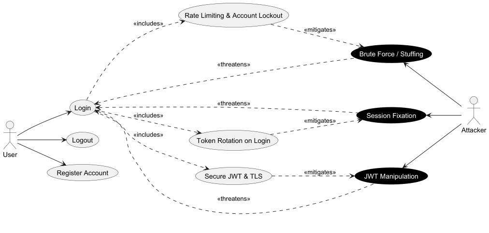

The login flow is threatened by **Brute Force / Credential Stuffing**, **Session Fixation**, and **JWT Manipulation**. Mitigations include rate limiting with account lockout, token rotation on login, and secure JWT validation over TLS.

### User Management / Administration
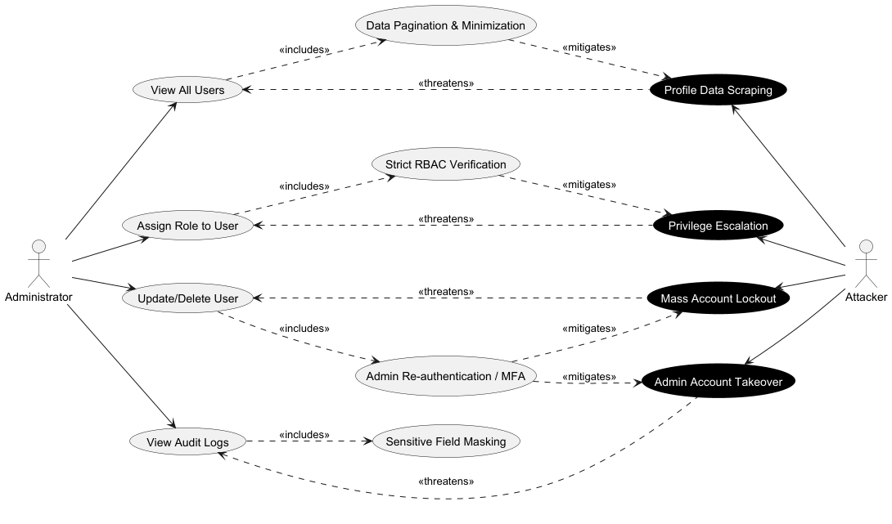

Administrative operations are threatened by **Privilege Escalation** (role manipulation), **Profile Data Scraping** (bulk user enumeration), **Mass Account Lockout** (abusing delete/update endpoints), and **Admin Account Takeover**. Mitigations include strict RBAC verification, data pagination, re-authentication for destructive actions, and sensitive field masking in audit logs.

### Vault Management
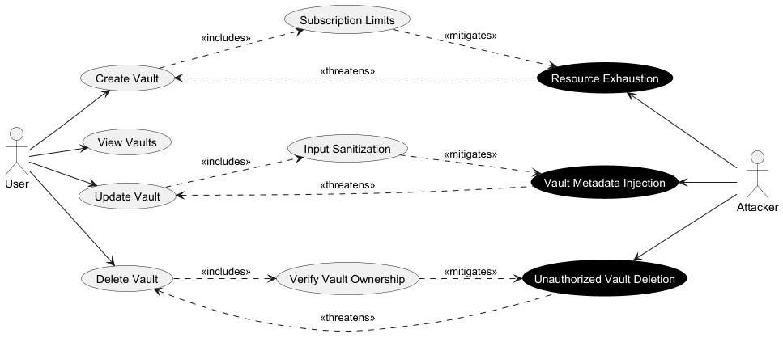

Vault operations are threatened by **Unauthorized Vault Deletion**, **Vault Metadata Injection** (malicious input in update requests), and **Resource Exhaustion**. Mitigations include ownership verification, input sanitization, and creation quotas per user.

### Credential Management
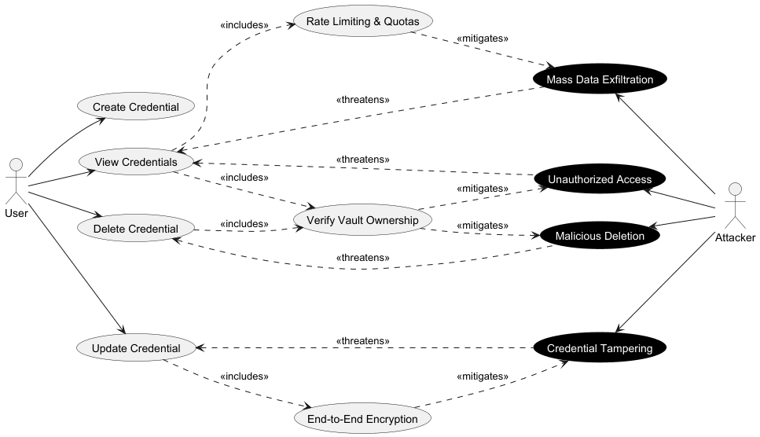

Credential operations are threatened by **Unauthorized Access**, **Credential Tampering** (modifying ciphertext without authenticated encryption), **Mass Data Exfiltration** (bulk reads via enumeration), and **Malicious Deletion** (removing another user's credentials via stolen token). Mitigations include vault ownership verification, end-to-end encryption, and rate limiting.

### Trusted Device Management
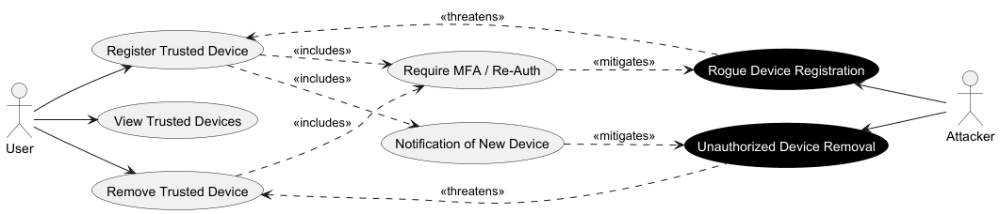

Device management is threatened by **Rogue Device Registration** (attacker registers their own device using a stolen session) and **Unauthorized Device Removal** (attacker removes a legitimate device to lock out the owner). Mitigations include MFA re-authentication before registration or removal, and out-of-band notifications to the user on device changes.

### Import / Export
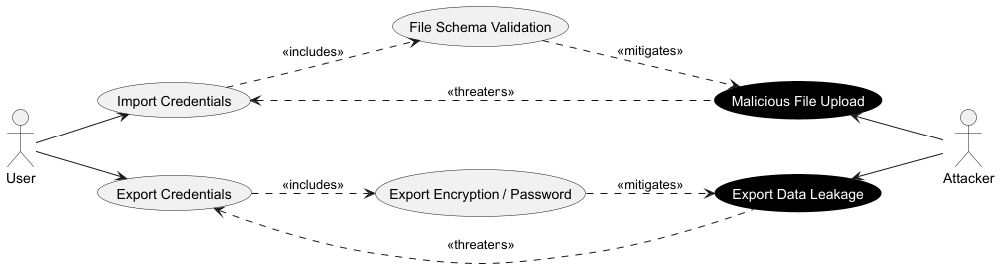

The import flow is threatened by **Malicious File Upload** (oversized files, zip bombs, or payloads with path traversal characters). The export flow is threatened by **Export Data Leakage** (unprotected temporary files readable by other processes). Mitigations include strict file schema validation and size limits for import, and encrypted/password-protected output for export.

### Audit Log
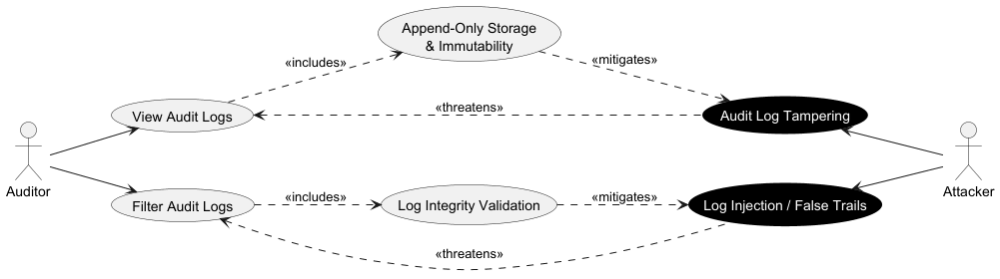

Audit log operations are threatened by **Audit Log Tampering** (a compromised admin alters or deletes log entries to cover tracks) and **Log Injection / False Trails** (attacker injects malicious payloads into logged fields to exploit the log viewer or forge events). Mitigations include append-only storage with immutability guarantees and log integrity validation on read.

## Threat Tree Analysis

### User Authentication

The root goal is gaining unauthorized access to a user account. Attack paths include credential stuffing via automated tools, brute-forcing weak passwords, stealing session tokens via XSS or MitM, and forging or replaying JWT tokens with manipulated claims.

### User Management
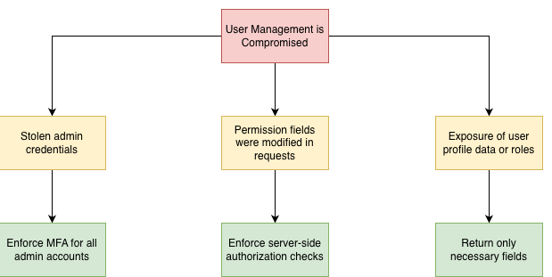

The root goal is gaining elevated privileges or taking over administrative control. Attack paths include manipulating role assignment requests (privilege escalation), stealing admin credentials, and abusing account management endpoints to lock out legitimate users.

### Vault Management

The root goal is accessing or destroying vaults that do not belong to the attacker. Attack paths include IDOR on vault endpoints (guessing or enumerating vault IDs), session hijacking to impersonate the vault owner, and injecting malicious metadata through unvalidated update requests.

### Credential Management
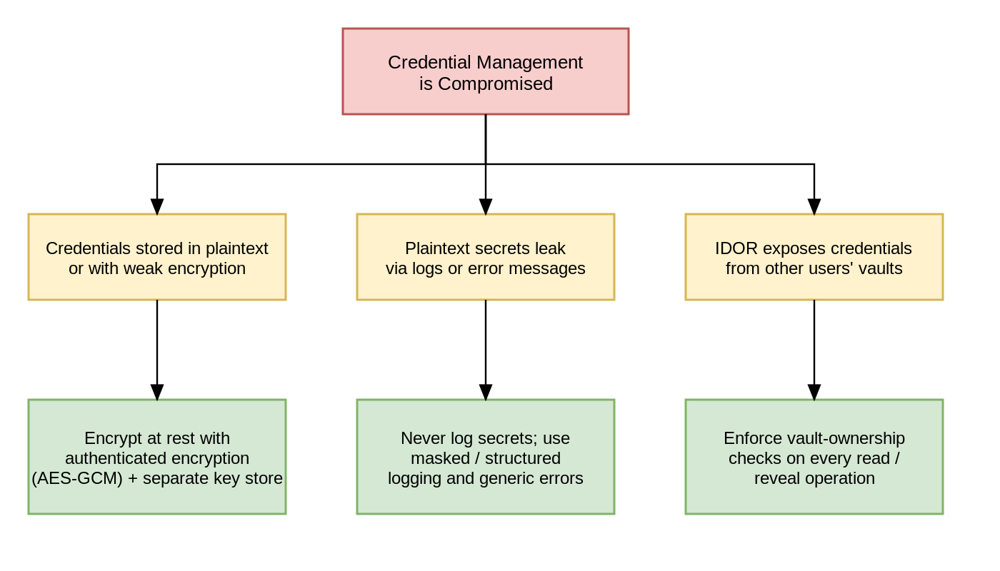

The root goal is reading, modifying, or deleting credentials belonging to other users. Attack paths include IDOR on credential endpoints, tampering with ciphertext to corrupt stored data, exfiltrating credentials via bulk enumeration, and exploiting decryption error paths to leak plaintext values.

### Trusted Devices Management
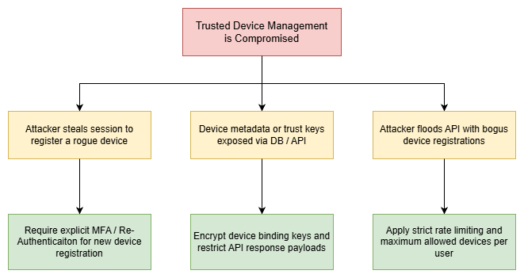

The root goal is binding a rogue device to a victim's account or removing a legitimate device. Attack paths include stealing an active session token to bypass MFA on device registration, and exploiting missing re-authentication on the remove endpoint to evict trusted devices.

### Import Vault
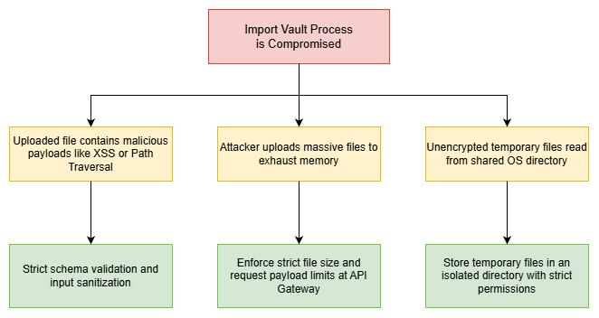

The root goal is compromising the server or injecting malicious data through the import endpoint. Attack paths include uploading oversized or malformed files (zip bombs, malicious CSVs), injecting path traversal sequences in parsed fields, and targeting a vault the attacker does not own via IDOR on the import request.

### Export Vault
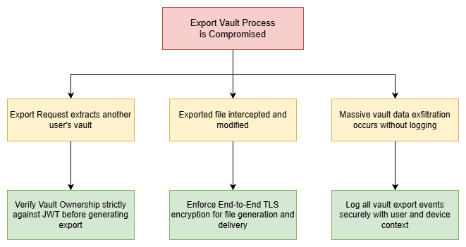

The root goal is obtaining a full export of credentials belonging to another user. Attack paths include IDOR on the export endpoint (specifying another user's vault ID), session hijacking to impersonate the vault owner, and reading the unprotected temporary export file from the server filesystem.

### System Audit Log
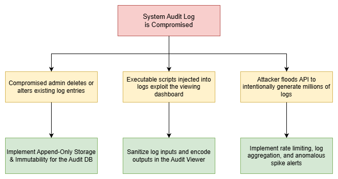

The root goal is either destroying evidence of malicious activity or exploiting the log pipeline. Attack paths include tampering with or deleting log entries via a compromised admin account, flooding the log store to exhaust disk space, and injecting executable payloads into logged fields (Log4Shell-style) to exploit the log viewer.

### Secure Wipe Temporary Files
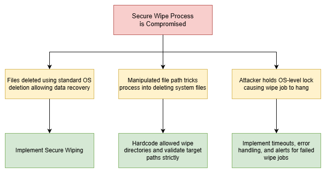

The root goal is leaving sensitive credential data on disk after an import or export operation. Attack paths include holding an OS-level file lock to prevent the wipe from executing, tricking the wipe process into deleting a wrong path via path traversal, and relying on standard OS deletion (which only removes the pointer) to allow data recovery with forensic tools.

## Threat Ranking

Threats are ranked using the **DREAD** risk assessment model. Each threat is scored from 1–10 across five factors:

| Factor | Question |
|--------|----------|
| **D**amage | How big would the damage be if the attack succeeded? |
| **R**eproducibility | How easy is it to reproduce the attack? |
| **E**xploitability | How much effort and expertise is needed to exploit it? |
| **A**ffected Users | What percentage of users would be affected? |
| **D**iscoverability | How easy is it for an attacker to discover this threat? |

**DREAD Score** = (D + R + E + A + Di) / 5 — ranges: High ≥ 7.5 | Medium 5.0–7.4 | Low < 5.0

| Risk ID | Threat | D | R | E | A | Di | Score | Level |
|---------|--------|---|---|---|---|----|-------|-------|
| R01 | Brute Force / Credential Stuffing | 8 | 10 | 9 | 10 | 9 | **9.2** | High |
| R02 | JWT Manipulation (EoP) | 9 | 7 | 6 | 5 | 6 | **6.6** | Medium |
| R03 | Credentials Exposed in Transit or at Rest | 9 | 7 | 6 | 10 | 5 | **7.4** | Medium |
| R04 | Privilege Escalation (role manipulation) | 9 | 6 | 6 | 7 | 5 | **6.6** | Medium |
| R05 | IDOR on Credential Endpoints | 9 | 9 | 9 | 10 | 8 | **9.0** | High |
| R06 | Plaintext Credential Leak | 9 | 6 | 6 | 7 | 5 | **6.6** | Medium |
| R07 | IDOR on Vault Endpoints | 7 | 9 | 8 | 10 | 8 | **8.4** | High |
| R08 | Malicious File Upload | 9 | 8 | 7 | 8 | 7 | **7.8** | High |
| R09 | Temporary File Exposed on Disk | 8 | 6 | 5 | 7 | 4 | **6.0** | Medium |
| R10 | IDOR on Export Endpoint | 9 | 9 | 9 | 10 | 8 | **9.0** | High |
| R11 | Export Endpoint Abuse (DoS) | 6 | 9 | 9 | 10 | 8 | **8.4** | High |
| R12 | Temporary File Not Securely Wiped | 9 | 7 | 6 | 8 | 5 | **7.0** | Medium |
| R13 | Path Traversal in Secure Wipe | 9 | 6 | 6 | 5 | 4 | **6.0** | Medium |
| R14 | Audit Log Tampering / Deletion | 8 | 4 | 4 | 5 | 3 | **4.8** | Low |
| R15 | Log Injection (Log4Shell-like) | 7 | 5 | 5 | 6 | 4 | **5.4** | Medium |
| R16 | Log Flooding (DoS) | 5 | 9 | 9 | 8 | 7 | **7.6** | High |
| R17 | Rogue Device Registration | 7 | 6 | 6 | 5 | 5 | **5.8** | Medium |
| R18 | Admin Actions Not Logged | 6 | 5 | 4 | 7 | 3 | **5.0** | Medium |
| R19 | Session Hijacking for Vault Export | 8 | 6 | 6 | 5 | 6 | **6.2** | Medium |
| R20 | Wipe Failure Not Logged | 7 | 6 | 5 | 7 | 3 | **5.6** | Medium |

### DREAD Priority Summary

| Level | Threshold | Count | Threat IDs |
|-------|-----------|-------|------------|
| **High** | Score ≥ 7.5 | 7 | R01, R05, R10, R07, R11, R08, R16 |
| **Medium** | Score 5.0–7.4 | 12 | R03, R12, R02, R04, R06, R19, R09, R13, R17, R20, R15, R18 |
| **Low** | Score < 5.0 | 1 | R14 |

For detailed mitigations for each identified risk, see [ThreatIdentification.md](./ThreatIdentification.md#mitigations).

From: https://owasp.org/www-community/Threat_Modeling_Process#threat-model-information-sample