# Threat Identification

## Threat Model Information

Application Name: Kryptos
Application Version: 1.0
Document Owner: DESOFS Group THU FFS 2
Participants: Bruno Lourenço, Diogo Paiva, Diana Neves, Filipa Cardoso
Reviewer: Paulo Baltarejo Sousa (PBS)

Description:
Kryptos is a secure credential management system designed to store sensitive authentication data like website logins. The application is structured around four main aggregates: User, Vault, Credential, and TrustedDevice.

Users can register and authenticate to access their personal data. Credentials are stored within vaults, allowing structured organization of sensitive information. The system also tracks trusted devices to enhance security monitoring.

Kryptos implements role-based access control with three types of users:
• Regular Users – can manage their own vaults and credentials, and perform import/export operations
• Administrators – can manage users, assign roles, and oversee system activity
• Auditors – can review logs and monitor system operations for security and compliance

## External Dependencies

| ID | Description  |
|----|--------------|
| 1  | The database server will be SQL   |

## Entry Points

Entry points define the interfaces through which potential attackers can interact with the application or supply it with data.

| ID | Name | Description                                                                                                   | Trust Levels |
|----|------|---------------------------------------------------------------------------------------------------------------|--------------|
| 1  | HTTPS Interface | Kryptos is accessed via a secure HTTPS API. This singular external entry point exposes all application features, including the endpoints where users submit data to register accounts and provide credentials to authenticate. | (1) Anonymous User   (2) Authenticated User   (3) Administrator   (4) Auditor |
| 2  | Authentication Function | Processes user credentials, validates them against stored data, and establishes a session.                    | (2) Authenticated User   (3) Administrator   (4) Auditor |
| 3  | Vault Management Interface | Allows users to create, edit, and delete vaults used to organize credentials.                                 | (2) Authenticated User |
| 4  | Credential Management Interface | Allows users to create, view, update, and delete stored credentials.                                          | (2) Authenticated User |
| 5  | Trusted Device Management | Allows users to associate, view, and remove trusted devices linked to their account or credential access.     | (2) Authenticated User   (3) Administrator |
| 6  | Import Credentials Function | Allows users to upload credential s from local files into the system. Involves file reading and processing.   | (2) Authenticated User |
| 7  | Export Credentials Function | Allows users to export stored credentials into temporary files on the server. Involves file creation and storage. | (2) Authenticated User |
| 8 | User Management Interface | Allows administrators to manage users, assign roles, and control account status.                              | (3) Administrator |
| 9 | Audit Logs Interface | Allows administrators and auditors to view logs of system activities and security-relevant events.            | (3) Administrator   (4) Auditor |

## Exit Points

| ID | Name | Description |
|----|------|-------------|
| 1 | HTTPS Responses | All data returned to clients (HTML, JSON, API responses) is sent through HTTPS. Improper output encoding or error handling may reveal system logic, enable account enumeration, leading to XSS or data leakage. |
| 3 | Authentication Token / Session Creation | Generates and returns session tokens or authentication cookies. Weak handling may lead to session hijacking or leakage. |
| 4 | Vault Data Output | Returns vault information to the user interface. Improper access control or filtering may expose other users’ data. |
| 5 | Credential Data Output | Returns stored credentials (potentially sensitive data). Must ensure encryption and proper masking where applicable. |
| 6 | Trusted Device Data Output | Returns information about trusted devices. Improper exposure may leak device identifiers. |
| 7 | Imported Data Processing Output | Returns results of credential import (success/failure, parsed data). Errors may expose file structure or parsing logic. |
| 8 | Exported File Output | Generates files containing credentials and stores them temporarily on disk. Improper handling may lead to sensitive data exposure. |
| 9 | User Management Responses | Returns results of administrative actions (user creation, role changes). May expose sensitive system or user information if not controlled. |
| 10 | Audit Log Output | Returns system logs to administrators and auditors. Logs may contain sensitive operational or user data. |

## Assets

| ID  | Name | Description |
|-----|------|-------------|
| 1   | Users | Assets related to all system users (Regular Users, Administrators, Auditors). |
| 1.1 | User Login Credentials | Authentication data (e.g., usernames, passwords) used to access the system. |
| 1.2 | Personal User Data | Information stored about users (e.g., email). |
| 1.3 | User Roles and Permissions | Role assignments (User, Admin, Auditor) that control access to system functionality. |
| 2   | Credentials Management | Assets related to stored credentials and vault organization. |
| 2.1 | Stored Credentials | Sensitive authentication data (e.g., usernames, passwords) stored by users. |
| 2.2 | Vault Data | Logical grouping of credentials belonging to a user. |
| 2.3 | Trusted Device Data | Information about devices associated with user sessions and credential access. |
| 3   | System | Assets related to system infrastructure and execution environment. |
| 3.1 | Application Availability | The Kryptos system should remain available and accessible to authorized users. |
| 3.2 | File System Access | Ability of the application to create, read, and delete files on the server (used in import/export). |
| 3.3 | Execution Environment | The server environment where the application runs and processes requests. |
| 4   | Application | Assets related to application-level functionality and security. |
| 4.1 | User Sessions | Active authenticated sessions between users and the system. |
| 4.2 | Import/Export Data | Temporary credential data handled during import/export operations. |
| 4.3 | Audit Logs | Logs containing records of user actions and system events for monitoring and compliance. |
| 4.4 | Access Control Mechanism | Role-based access control system enforcing permissions across the application. |

## Trust Levels

| ID | Name | Description                                                                                                   |
|----|------|---------------------------------------------------------------------------------------------------------------|
| 1 | Anonymous User | A user who can access the Kryptos interface but has not authenticated and/or does not have valid credentials. |
| 2 | Authenticated User | A regular user who has successfully logged into the system and can manage their own vaults and credentials.   |
| 3 | Administrator | A privileged user who can manage users, assign roles, and oversee system operations.                          |
| 4 | Auditor | A user with read-only access to audit logs and system activity for monitoring and compliance purposes.        |

## Data Flow Diagrams

### System Overview (Level 0)

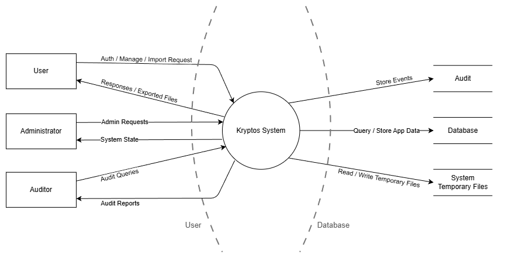

### User Authentication

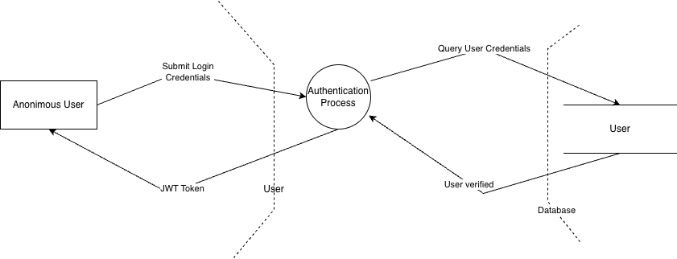

### User Management

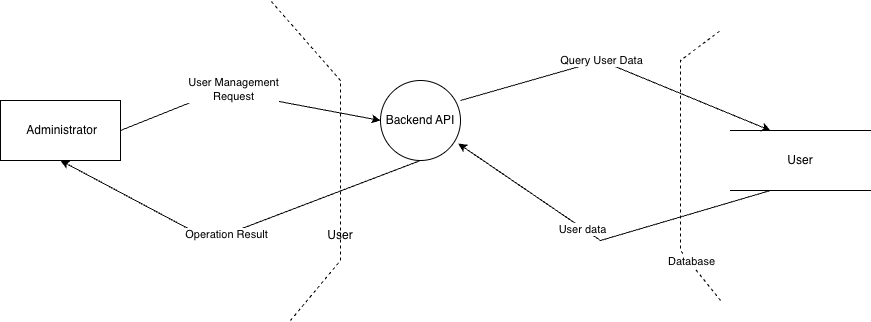

### Vault Management

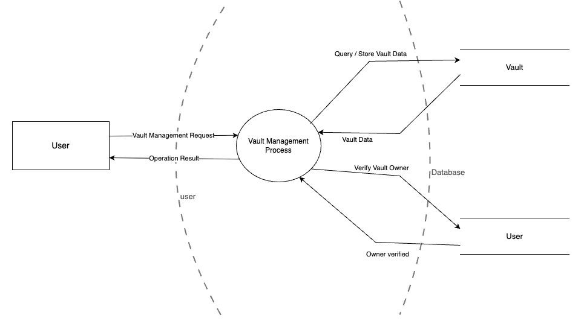

### Credential Management

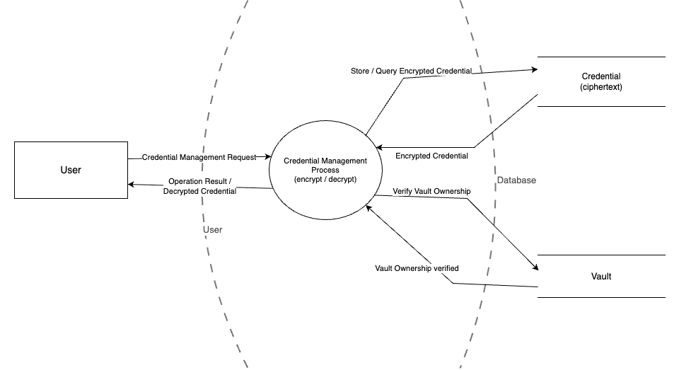

### Trusted Devices Management

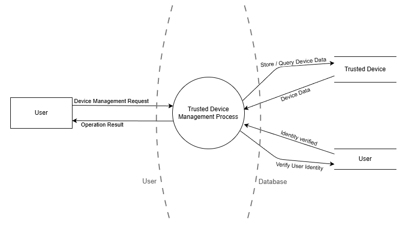

### Import Vault

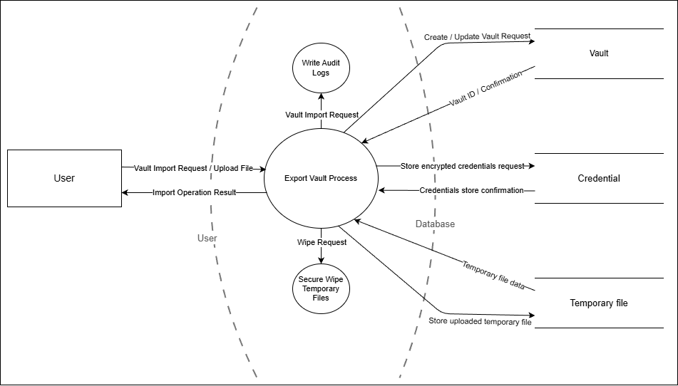

#### Import Vault (Level 2)

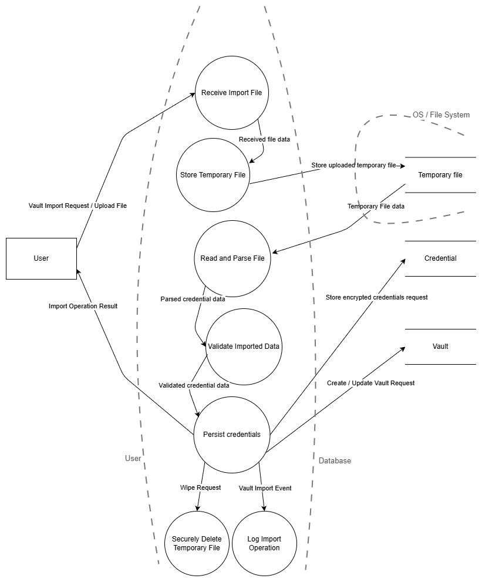

### Export Vault

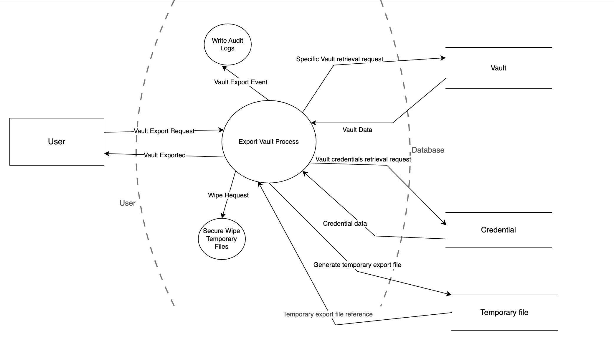

#### Export Vault (Level 2)

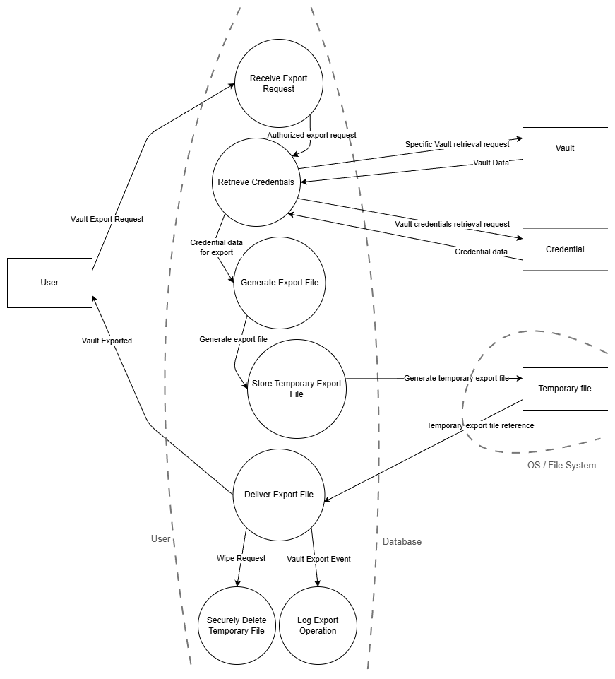

### Audit Log

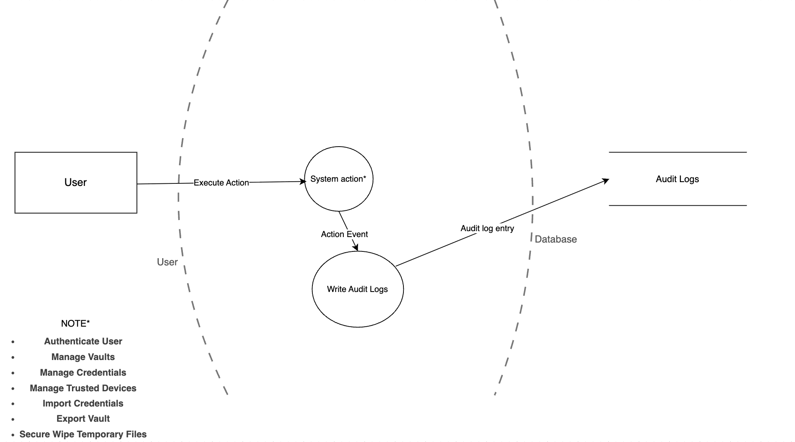

### Secure Wipe Temporary Files

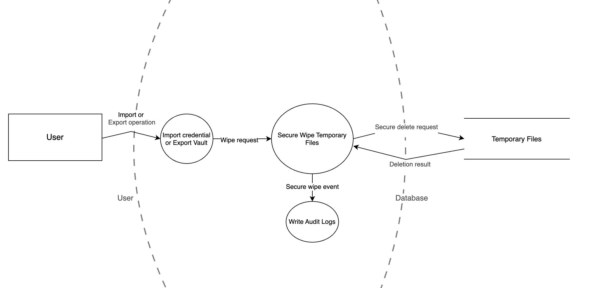

## Risk Assessment

### Methodology

Risk is assessed using the **OWASP Risk Rating Methodology**, combining two dimensions:

- **Likelihood** — how probable it is that the threat is successfully exploited (Low / Medium / High)
- **Impact** — the potential damage to confidentiality, integrity, availability, or compliance if the threat is realised (Low / Medium / High)
- **Risk Level** — derived from the combination: Low (L×L), Medium (L×H, M×M, H×L), High (M×H, H×M), Critical (H×H)

### Risk Matrix

| ID | Threat | DFD Area | STRIDE | Likelihood | Impact | Risk Level |
|----|--------|----------|--------|------------|--------|------------|
| R01 | Brute Force / Credential Stuffing | User Authentication | Spoofing / DoS | High | High | **Critical** |
| R02 | JWT Manipulation (Elevation of Privilege) | User Authentication | EoP | Medium | High | **High** |
| R03 | Credentials exposed in transit or at rest | User Authentication | Tampering / Info Disclosure | Medium | High | **High** |
| R04 | Privilege Escalation (role manipulation) | User Management | EoP / Tampering | Medium | High | **High** |
| R05 | IDOR on Credential endpoints | Credential Management | EoP / Info Disclosure | High | High | **Critical** |
| R06 | Plaintext credential leak (error, logs, dump) | Credential Management | Info Disclosure | Medium | High | **High** |
| R07 | IDOR on Vault endpoints | Vault Management | Info Disclosure / EoP | High | Medium | **High** |
| R08 | Malicious File Upload (Path Traversal, Zip Bomb) | Import Vault | Tampering / DoS | High | High | **Critical** |
| R09 | Temporary file exposed on disk | Import / Export | Info Disclosure | Medium | High | **High** |
| R10 | IDOR on Export endpoint | Export Vault | EoP | High | High | **Critical** |
| R11 | Export endpoint abuse (DoS) | Export Vault | DoS | High | Medium | **High** |
| R12 | Temporary file not securely wiped | Secure Wipe | Info Disclosure | High | High | **Critical** |
| R13 | Path Traversal in secure wipe process | Secure Wipe | EoP | Medium | High | **High** |
| R14 | Audit log tampering / deletion | Audit Log | Tampering | Low | High | **Medium** |
| R15 | Log injection (Log4Shell-like) | Audit Log | EoP | Low | High | **Medium** |
| R16 | Log flooding (DoS) | Audit Log | DoS | High | Medium | **High** |
| R17 | Rogue device registration via session hijack | Trusted Devices | Spoofing / EoP | Medium | High | **High** |
| R18 | Admin actions not logged | User Management | Repudiation | Medium | Medium | **Medium** |
| R19 | Session hijacking for vault export | Export Vault | Spoofing | Medium | High | **High** |
| R20 | Wipe failure not logged (data left on disk) | Secure Wipe | Repudiation | Medium | High | **High** |

### Risk Priority Summary

| Risk Level | Count | Threat IDs |
|------------|-------|------------|
| **Critical** | 5 | R01, R05, R08, R10, R12 |
| **High** | 12 | R02, R03, R04, R06, R07, R09, R11, R13, R16, R17, R19, R20 |
| **Medium** | 3 | R14, R15, R18 |
| **Low** | 0 | — |

From: <https://owasp.org/www-community/Threat_Modeling_Process#threat-model-information-sample>

## Mitigations

The following mitigations target the **Critical**, **High** and **Medium** priority threats identified in the Risk Assessment. Mitigations are specific, feasible, and aligned with OWASP best practices.

### Critical Threats

**R01 – Brute Force / Credential Stuffing**

- Implement rate limiting on the login endpoint (e.g., max 5 attempts per minute per IP)
- Apply account lockout or progressive delay after repeated failures
- Log all failed authentication attempts with IP and timestamp
- Consider CAPTCHA or MFA for repeated failure scenarios

**R05 – IDOR on Credential Endpoints**

- Enforce ownership checks on every credential operation: validate that the authenticated user owns the requested resource before returning or modifying it
- Never expose sequential or guessable IDs in API responses; use UUIDs
- Apply authorization at the service layer, not only at the controller level

**R08 – Malicious File Upload (Path Traversal, Zip Bomb)**

- Validate file size before processing (enforce strict maximum upload size)
- Validate file format and content type; reject unexpected structures
- Sanitize all field values parsed from the file to prevent injection
- Store uploaded files in an isolated directory outside the web root
- Never use user-supplied paths or filenames for server-side file operations

**R10 – IDOR on Export Endpoint**

- Validate vault ownership before generating the export file
- Ensure the Vault ID in the export request belongs to the authenticated user
- Log all export requests with user ID, vault ID, and timestamp

**R12 – Temporary File Not Securely Wiped**

- Use a cryptographic secure wipe function (e.g., overwrite with zeros/random bytes before deletion)
- Never rely on standard OS `delete` or `unlink` for sensitive files
- Enforce cleanup in a `finally` block to guarantee execution even on error
- Verify the wipe completed successfully and log the result to the audit log

---

### High Threats

**R02 – JWT Manipulation**

- Sign JWTs with a strong algorithm (RS256 or HS256 with a secret of sufficient entropy)
- Validate the `alg`, `exp`, `iss`, and `sub` claims on every request
- Reject tokens with the `none` algorithm
- Set short expiration times (e.g., 15–60 minutes); use refresh tokens for session continuity

**R03 – Credentials Exposed in Transit or at Rest**

- Enforce HTTPS/TLS on all endpoints; reject unencrypted connections
- Encrypt stored credentials using AES-256 with a key stored separately from the database
- Use authenticated encryption (AES-GCM) to prevent undetected ciphertext tampering

**R04 – Privilege Escalation via Role Manipulation**

- Enforce RBAC checks at the service layer for every role-sensitive operation
- Never trust role claims from user-supplied input; derive roles from the server-side token or session only
- Log all role assignment and account modification actions by administrators

**R06 – Plaintext Credential Leak**

- Never log credential values, even in debug mode
- Return only masked or encrypted representations in API responses
- Disable stack trace and verbose error messages in production
- Audit error handling paths to ensure no sensitive data is included in exception messages

**R07 – IDOR on Vault Endpoints**

- Apply the same ownership validation strategy as R05 to all vault operations
- Test all vault endpoints for IDOR using automated security tests

**R09 – Temporary File Exposed on Disk**

- Set restrictive file permissions (e.g., `600`) on temporary files at creation time
- Store temporary files in a dedicated, isolated directory with no public or shared access
- Delete the file immediately after use, before returning the API response

**R11 – Export Endpoint Abuse (DoS)**

- Apply rate limiting on the export endpoint (e.g., max 3 exports per user per hour)
- Queue export jobs asynchronously to prevent request blocking

**R13 – Path Traversal in Secure Wipe**

- Never construct file paths using user-supplied input
- Validate and canonicalize all file paths before use; reject paths containing `..` or absolute references
- Run the secure wipe process with the minimum required OS privileges

**R16 – Log Flooding (DoS)**

- Implement log rate limiting or sampling under high load
- Monitor log storage usage and alert on abnormal growth
- Use structured logging with severity filtering to discard low-value events under stress

**R17 – Rogue Device Registration**

- Require re-authentication or MFA confirmation before registering a new trusted device
- Notify the user via a secondary channel (e.g., email) when a new device is registered
- Log all device registration and removal events

**R19 – Session Hijacking for Vault Export**

- Bind JWT tokens to a device fingerprint or IP where feasible
- Implement short token lifetimes with refresh token rotation
- Invalidate tokens on logout and suspicious activity detection

**R20 – Wipe Failure Not Logged**

- Treat wipe failures as critical security events and write an audit log entry immediately
- Alert the system administrator if a temporary file cannot be wiped after a defined number of retries

---

### Medium Threats

**R14 – Audit Log Tampering / Deletion**

- Store audit logs in an append-only table; grant only `INSERT` permissions to the audit service account
- Forward logs to a separate, write-only log store that is not co-located with the primary database
- Consider log chaining (hash of entry N included in entry N+1) so that any retroactive modification invalidates the chain

**R15 – Log Injection (Log4Shell-like)**

- Use structured logging libraries that automatically escape control characters in log entries
- Never interpret log values as templates or expressions
- Keep logging libraries patched and tracked in the SCA pipeline

**R18 – Admin Actions Not Logged**

- Log every administrative action (user creation, role change, account disable) with the acting admin, target resource, and timestamp
- Route admin events into the same immutable audit log used for user events to ensure equal integrity guarantees
