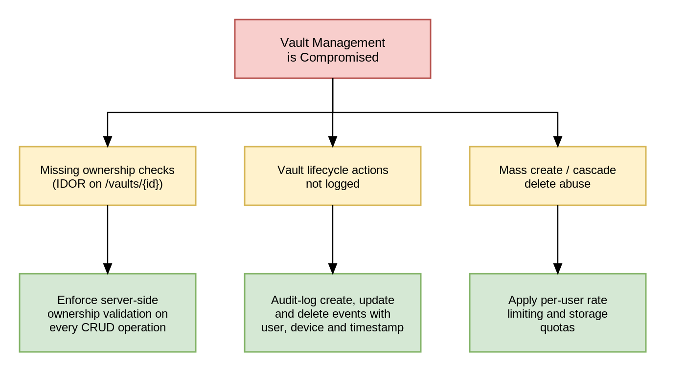

# STRIDE

## Threat List

### User Authentication

| DFD Element                             | STRIDE                     | Threats Across Data Flow                                                                                               | Abuse Case                            |
|-----------------------------------------|----------------------------|------------------------------------------------------------------------------------------------------------------------|---------------------------------------|
| **External Entity:** Anonymous User     | **Spoofing**               | Attacker pretends to be a user using stolen credentials, API, or database (e.g., stolen credentials, fake services).   | **Brute Force / Credential Stuffing** |
| **Data Flow:** Submit Login Credentials | **Tampering**              | Data (credentials, queries, tokens) is modified during transmission or processing.                                     | ---                                   |
| **Process:** Authentication Process     | **Repudiation**            | Actions cannot be traced because of missing or insufficient logging.                                                   | ---                                   |
| **Data Store:** User DB                 | **Information Disclosure** | Sensitive data (credentials, tokens, hashes) is exposed to unauthorized parties.                                       | ---                                   |
| **Process:** Authentication Process     | **Denial of Service**      | Login system or database is overwhelmed, making authentication unavailable.                                            | **Brute Force / Credential Stuffing** |
| **Data Flow:** JWT Token                | **Elevation of Privilege** | Attacker manipulates the token payload to gain higher access (e.g., admin rights) through stolen data or system flaws. | ---                                   |

### User Management

| DFD Element                            | STRIDE                     | Threats Across Data Flow                                                                                  | Abuse Case               |
|----------------------------------------|----------------------------|-----------------------------------------------------------------------------------------------------------|--------------------------|
| **External Entity:** User              | **Spoofing**               | Attacker impersonates an admin, API, or database (e.g., stolen admin credentials, fake services).         | ---                      |
| **Data Flow:** User Management Request | **Tampering**              | User management requests or database queries are modified (e.g., changing roles or permissions).          | ---                      |
| **Process:** Backend API               | **Repudiation**            | Admin actions cannot be verified due to missing or insufficient logging.                                  | ---                      |
| **Data Store:** User DB                | **Information Disclosure** | Sensitive user data (e.g., roles, emails) is exposed to unauthorized parties.                             | ---                      |
| **Process:** Backend API               | **Denial of Service**      | User management endpoints or database are overloaded, preventing admin operations.                        | ---                      |
| **Process:** Backend API               | **Elevation of Privilege** | Unauthorized users gain higher roles (e.g., becoming admin) through manipulated requests or system flaws. | **Privilege Escalation** |

### Vault Management

| DFD Element                             | STRIDE                     | Threats Across Data Flow                                                                                                                                                                     | Abuse Case                       |
|-----------------------------------------|----------------------------|----------------------------------------------------------------------------------------------------------------------------------------------------------------------------------------------|----------------------------------|
| **External Entity:** User               | **Spoofing**               | Attacker impersonates a legitimate user (via stolen JWT, session hijacking, or forged API requests) to access or manipulate vaults that do not belong to them.                               | ---                              |
| **Data Flow:** Vault Management Request | **Tampering**              | Vault requests are modified in transit to alter names, descriptions, or ownership; attacker rewrites vault records in the database or bypasses ownership checks to edit other users' vaults. | ---                              |
| **Process:** Vault Management Process   | **Repudiation**            | Vault creation, update, or deletion events are not logged (or are logged without user/device context), allowing a user to deny having performed destructive actions.                         | ---                              |
| **Data Flow:** Query / Store Vault      | **Information Disclosure** | Vault metadata (names, descriptions, owner identifiers) is exposed to unauthorized users due to missing or incorrect authorization checks (IDOR on `/vaults/{id}`).                          | **Unauthorized Vault Deletion**  |
| **Process:** Vault Management Process   | **Denial of Service**      | Attacker abuses create/delete endpoints (mass vault creation, cascading deletes) to exhaust storage, saturate database connections, or lock tables.                                          | ---                              |
| **Process:** Vault Management Process   | **Elevation of Privilege** | Attacker bypasses role checks (e.g., uses a Regular User token to call admin-only vault endpoints) to manage vaults belonging to other users.                                                | **Unauthorized Vault Deletion**  |

### Credential Management

| DFD Element                                | STRIDE                     | Threats Across Data Flow                                                                                                                                                                                                               | Abuse Case                         |
|--------------------------------------------|----------------------------|----------------------------------------------------------------------------------------------------------------------------------------------------------------------------------------------------------------------------------------|------------------------------------|
| **External Entity:** User                  | **Spoofing**               | Attacker uses stolen tokens or session cookies to read, modify, or delete credentials stored in another user's vault.                                                                                                                  | ---                                |
| **Process:** Credential Management Process | **Tampering**              | Ciphertext is modified in transit or at rest (without authenticated encryption), leading to corrupted credentials that may decrypt into attacker-controlled plaintext; request payloads are tampered with to inject malicious content. | **Credential Tampering**           |
| **Process:** Credential Management Process | **Repudiation**            | Credential reads (especially decrypted reveals) and modifications are not logged or are logged without sufficient context, allowing a user to deny exfiltration.                                                                       | ---                                |
| **Data Store:** Credential DB              | **Information Disclosure** | Plaintext credentials leak via error messages, debug logs, memory dumps, or insecure responses; encryption keys are exposed via the key store or application memory; IDOR allows fetching another user's credentials.                  | ---                                |
| **Process:** Credential Management Process | **Denial of Service**      | Brute-force or enumeration requests on credential endpoints saturate the decryption service; repeated malformed ciphertext triggers expensive error paths.                                                                             | ---                                |
| **Data Flow:** Verify Vault Ownership      | **Elevation of Privilege** | Attacker who compromises one account moves laterally by exfiltrating credentials that grant access to other systems (credential reuse), or exploits missing authorization to read credentials from other users' vaults.                | **Unauthorized Credential Access** |

### Trusted Devices Management

| DFD Element                                      | STRIDE                       | Threats Across Data Flow                                                                                                                                   | Abuse Case                    |
|--------------------------------------------------|------------------------------|------------------------------------------------------------------------------------------------------------------------------------------------------------|-------------------------------|
| **External Entity:** User                        | **Spoofing**                 | Attacker steals an active session token (e.g., via Man-in-the-Middle or XSS) and impersonates the user to register their own device as trusted.            | **Rogue Device Registration** |
| **Data Flow:** Device Management Request         | **Tampering**                | Device registration payload (e.g., device ID, public key, or fingerprint) is modified in transit to alter the device binding.                              | ---                           |
| **Process:** Trusted Device Management Process   | **Repudiation**              | The registration or removal of a trusted device is not logged, allowing an attacker (or user) to deny that a new device was authorized.                    | ---                           |
| **Data Store:** Trusted Device (DB)              | **Information Disclosure**   | Device metadata, user associations, or potentially cryptographic material used for trust binding are exposed via insecure API responses or database dumps. | ---                           |
| **Process:** Trusted Device Management Process   | **Denial of Service**        | Attacker repeatedly sends bogus device registration requests to overwhelm the database or exhaust the maximum allowed devices per user.                    | ---                           |
| **Process:** Trusted Device Management Process   | **Elevation of Privilege**   | Attacker manipulates the request to bind a device to a different user's account by exploiting an IDOR vulnerability, bypassing standard MFA challenges.    | **Rogue Device Registration** |

### Import Vault

| DFD Element                                       | STRIDE                     | Threats Across Data Flow                                                                                                                                                                    | Abuse Case                |
|---------------------------------------------------|----------------------------|---------------------------------------------------------------------------------------------------------------------------------------------------------------------------------------------|---------------------------|
| **External Entity:** User                         | **Spoofing**               | Attacker uses a stolen session token to upload a credential file into a victim's account, potentially overwriting legitimate data.                                                          | ---                       |
| **Process:** Validate Imported Data               | **Tampering**              | The uploaded file contains malicious payloads (e.g., XSS in the username fields or Path Traversal characters like ../../../) to manipulate the system or other users when parsed.           | **Malicious File Upload** |
| **Process:** Log Import Operation                 | **Repudiation**            | The import action is not logged properly, allowing a malicious insider to upload compromised credentials and later deny having performed the action.                                        | ---                       |
| **Data Store:** Temporary file (OS / File System) | **Information Disclosure** | The temporary file containing unencrypted credentials is saved to the server's disk without strict read/write permissions, allowing other system processes to access it before it is wiped. | ---                       |
| **Process:** Receive Import File                  | **Denial of Service**      | Attacker uploads a massive file (e.g., a 50GB CSV or a Zip Bomb) to exhaust server memory, CPU during parsing, or disk space.                                                               | **Malicious File Upload** |
| **Process:** Persist credentials                  | **Elevation of Privilege** | Attacker manipulates the API request parameters alongside the file upload to force the system to import the credentials into a Vault ID they do not own (IDOR vulnerability).               | ---                       |

### Export Vault

| DFD Element                                       | STRIDE                     | Threats Across Data Flow                                                                                                                                                           | Abuse Case                     |
|---------------------------------------------------|----------------------------|------------------------------------------------------------------------------------------------------------------------------------------------------------------------------------|--------------------------------|
| **External Entity:** User                         | **Spoofing**               | Attacker uses a stolen session token or hijacked session to request a full export of the victim's vault.                                                                           | ---                            |
| **Data Flow:** Vault Exported                     | **Tampering**              | The exported file is intercepted and modified in transit (e.g., injecting malicious URLs into the credentials) before reaching the user's machine.                                 | ---                            |
| **Process:** Log Export Operation                 | **Repudiation**            | A massive data exfiltration (vault download) occurs but is not logged, preventing administrators from tracing the data leak back to the compromised account.                       | ---                            |
| **Data Store:** Temporary file (OS / File System) | **Information Disclosure** | The generated export file containing sensitive credentials is saved to a shared OS directory without strict read restrictions, allowing other internal processes/users to read it. | ---                            |
| **Process:** Generate Export File                 | **Denial of Service**      | Attacker repeatedly spams the export endpoint, forcing the server to continuously query the database and exhaust CPU/Memory by formatting large export files.                      | ---                            |
| **Process:** Retrieve Credentials                 | **Elevation of Privilege** | Attacker manipulates the Vault Export Request parameter to specify a Vault ID they do not own (IDOR), bypassing authorization to extract another user's entire vault.              | **Extract Unauthorized Vault** |

### System Audit Log

| DFD Element                     | STRIDE                     | Threats Across Data Flow                                                                                                                   | Abuse Case                |
|---------------------------------|----------------------------|--------------------------------------------------------------------------------------------------------------------------------------------|---------------------------|
| **Process:** Write Audit Logs   | **Spoofing**               | Attacker spoofs an internal system service to inject fake log events (e.g., faking a successful login to cover tracks).                    | ---                       |
| **Data Store:** Audit Logs (DB) | **Tampering**              | A compromised admin or attacker alters, truncates, or deletes existing log entries to hide evidence of malicious activity.                 | **Audit Log Tampering**   |
| **Process:** Write Audit Logs   | **Repudiation**            | The logging process fails silently or drops events under heavy load, meaning critical system actions are not recorded.                     | ---                       |
| **Data Store:** Audit Logs (DB) | **Information Disclosure** | The log database inadvertently stores sensitive data (e.g., plaintext passwords or session tokens) and is exposed to unauthorized staff.   | ---                       |
| **Process:** Write Audit Logs   | **Denial of Service**      | Attacker floods the API with invalid requests to intentionally generate millions of log entries, exhausting disk space (Log Flooding).     | ---                       |
| **Process:** Write Audit Logs   | **Elevation of Privilege** | Attacker injects executable scripts or malicious payloads into the logs (e.g., similar to Log4Shell) to exploit the log viewing dashboard. | ---                       |

### Secure Wipe Temporary Files

| DFD Element                              | STRIDE                     | Threats Across Data Flow                                                                                                                                                            | Abuse Case |
|------------------------------------------|----------------------------|-------------------------------------------------------------------------------------------------------------------------------------------------------------------------------------|------------|
| **Data Flow:** Wipe request              | **Spoofing**               | Attacker spoofs a wipe command to delete the temporary files prematurely, corrupting the ongoing Import/Export operation.                                                           | ---        |
| **Data Flow:** Secure delete request     | **Tampering**              | The deletion command is intercepted or blocked at the OS level, preventing the actual wipe from executing.                                                                          | ---        |
| **Data Flow:** Secure wipe event         | **Repudiation**            | The wipe process fails (e.g., due to file locks) but fails to send an error event to the Audit Log, silently leaving sensitive data on disk.                                        | ---        |
| **Data Store:** Temporary Files          | **Information Disclosure** | Files are deleted using standard OS deletion (removing the pointer) instead of cryptographic secure wiping (overwriting with zeros), allowing data recovery tools to extract them.  | ---        |
| **Data Store:** Temporary Files          | **Denial of Service**      | Attacker deliberately holds an OS-level lock on the temporary file, causing the secure wipe background job to hang or crash.                                                        | ---        |
| **Process:** Secure Wipe Temporary Files | **Elevation of Privilege** | Attacker manipulates the file path variable to trick the high-privileged secure wipe process into deleting critical system files instead of the temporary payload (Path Traversal). | ---        |

## Threat Tree Analysis

### User Authentication

### User Management

### Vault Management

### Credential Management

## Threat Ranking

Threats are ranked using the **DREAD** risk assessment model. Each threat is scored from 1–10 across five factors:

| Factor | Question |
|--------|----------|
| **D**amage | How big would the damage be if the attack succeeded? |
| **R**eproducibility | How easy is it to reproduce the attack? |
| **E**xploitability | How much effort and expertise is needed to exploit it? |
| **A**ffected Users | What percentage of users would be affected? |
| **D**iscoverability | How easy is it for an attacker to discover this threat? |

**DREAD Score** = (D + R + E + A + Di) / 5 — ranges: High ≥ 7.5 | Medium 5.0–7.4 | Low < 5.0

| Risk ID | Threat | D | R | E | A | Di | Score | Level |
|---------|--------|---|---|---|---|----|-------|-------|
| R01 | Brute Force / Credential Stuffing | 8 | 10 | 9 | 10 | 9 | **9.2** | High |
| R02 | JWT Manipulation (EoP) | 9 | 7 | 6 | 5 | 6 | **6.6** | Medium |
| R03 | Credentials Exposed in Transit or at Rest | 9 | 7 | 6 | 10 | 5 | **7.4** | Medium |
| R04 | Privilege Escalation (role manipulation) | 9 | 6 | 6 | 7 | 5 | **6.6** | Medium |
| R05 | IDOR on Credential Endpoints | 9 | 9 | 9 | 10 | 8 | **9.0** | High |
| R06 | Plaintext Credential Leak | 9 | 6 | 6 | 7 | 5 | **6.6** | Medium |
| R07 | IDOR on Vault Endpoints | 7 | 9 | 8 | 10 | 8 | **8.4** | High |
| R08 | Malicious File Upload | 9 | 8 | 7 | 8 | 7 | **7.8** | High |
| R09 | Temporary File Exposed on Disk | 8 | 6 | 5 | 7 | 4 | **6.0** | Medium |
| R10 | IDOR on Export Endpoint | 9 | 9 | 9 | 10 | 8 | **9.0** | High |
| R11 | Export Endpoint Abuse (DoS) | 6 | 9 | 9 | 10 | 8 | **8.4** | High |
| R12 | Temporary File Not Securely Wiped | 9 | 7 | 6 | 8 | 5 | **7.0** | Medium |
| R13 | Path Traversal in Secure Wipe | 9 | 6 | 6 | 5 | 4 | **6.0** | Medium |
| R14 | Audit Log Tampering / Deletion | 8 | 4 | 4 | 5 | 3 | **4.8** | Low |
| R15 | Log Injection (Log4Shell-like) | 7 | 5 | 5 | 6 | 4 | **5.4** | Medium |
| R16 | Log Flooding (DoS) | 5 | 9 | 9 | 8 | 7 | **7.6** | High |
| R17 | Rogue Device Registration | 7 | 6 | 6 | 5 | 5 | **5.8** | Medium |
| R18 | Admin Actions Not Logged | 6 | 5 | 4 | 7 | 3 | **5.0** | Medium |
| R19 | Session Hijacking for Vault Export | 8 | 6 | 6 | 5 | 6 | **6.2** | Medium |
| R20 | Wipe Failure Not Logged | 7 | 6 | 5 | 7 | 3 | **5.6** | Medium |

### DREAD Priority Summary

| Level | Threshold | Count | Threat IDs |
|-------|-----------|-------|------------|
| **High** | Score ≥ 7.5 | 7 | R01, R05, R10, R07, R11, R08, R16 |
| **Medium** | Score 5.0–7.4 | 12 | R03, R12, R02, R04, R06, R19, R09, R13, R17, R20, R15, R18 |
| **Low** | Score < 5.0 | 1 | R14 |

For detailed mitigations for each identified risk, see [ThreatIdentification.md](./ThreatIdentification.md#mitigations).

From: https://owasp.org/www-community/Threat_Modeling_Process#threat-model-information-sample