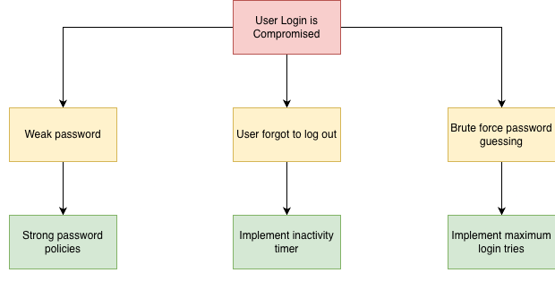

# STRIDE

## Threat List

### User Authentication

| STRIDE | Threats Across Data Flow |
|--------|--------------------------|
| **Spoofing** | Attacker pretends to be a user, API, or database (e.g., stolen credentials, fake services). |
| **Tampering** | Data (credentials, queries, tokens) is modified during transmission or processing. |
| **Repudiation** | Actions cannot be traced because of missing or insufficient logging. |
| **Information Disclosure** | Sensitive data (credentials, tokens, hashes) is exposed to unauthorized parties. |
| **Denial of Service** | Login system or database is overwhelmed, making authentication unavailable. |
| **Elevation of Privilege** | Attacker gains higher access (e.g., admin rights) through stolen data or system flaws. |

### User Management

| STRIDE | Threats Across Data Flow |
|--------|--------------------------|
| **Spoofing** | Attacker impersonates an admin, API, or database (e.g., stolen admin credentials, fake services). |
| **Tampering** | User management requests or database queries are modified (e.g., changing roles or permissions). |
| **Repudiation** | Admin actions cannot be verified due to missing or insufficient logging. |
| **Information Disclosure** | Sensitive user data (e.g., roles, emails) is exposed to unauthorized parties. |
| **Denial of Service** | User management endpoints or database are overloaded, preventing admin operations. |
| **Elevation of Privilege** | Unauthorized users gain higher roles (e.g., becoming admin) through manipulated requests or system flaws. |

## Threat Tree Analysis

### User Authentication

### User Management

## Threat Ranking

From: https://owasp.org/www-community/Threat_Modeling_Process#threat-model-information-sample