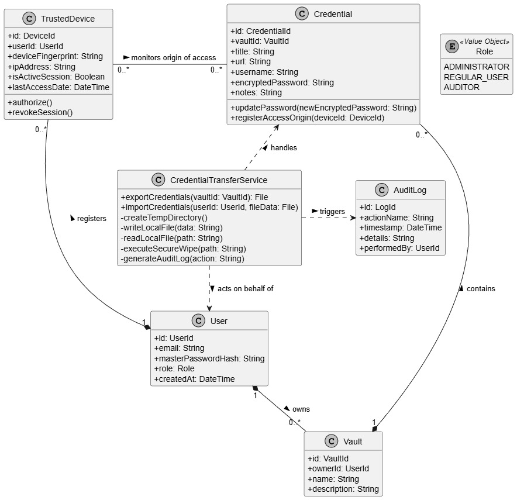
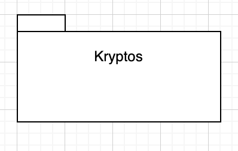
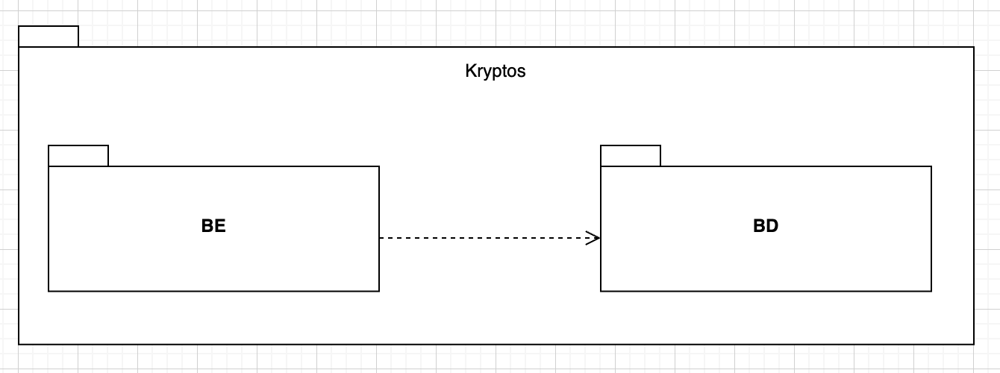
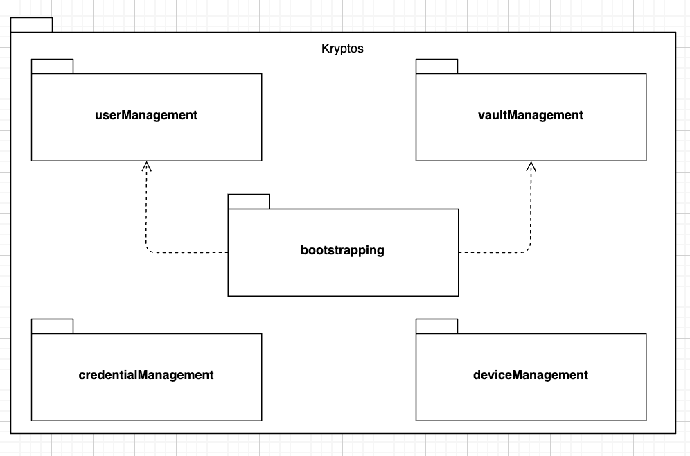
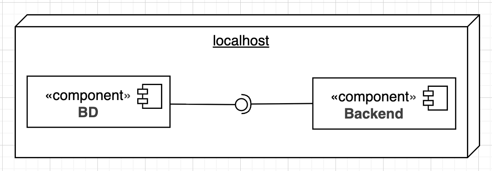
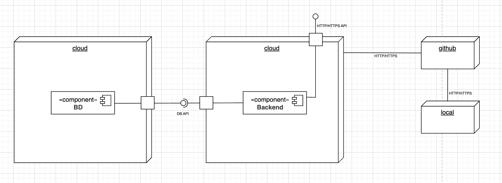

# System Overview

## Domain Model

## Use Case Diagram

## Functional Requirements

## Non-Functional Requirements

## Security Requirements

### General Requirements
- All endpoints must enforce authentication.
- All inputs must be validated and sanitized.
- All communication must use HTTPS.
- Passwords must be securely hashed.
- Rate limiting must be applied to sensitive endpoints, such as login.

### User Requirements
- As an anonymous user, I can securely register and log in.
- As an authenticated user, I can manage my vaults and credentials.
- As an authenticated user, I can manage my trusted devices.
- As an administrator, I can manage users and assign roles.
- As an administrator, I can monitor system activity securely.
- As an administrator, I can enforce access control policies.

## Architectural Design

### Logic view

#### Level 1:

#### Level 2:

#### Level 3:

### Implementation View

#### Level 1:

#### Level 2:

#### Level 3:

### Deployment View

#### Future Deployment View
